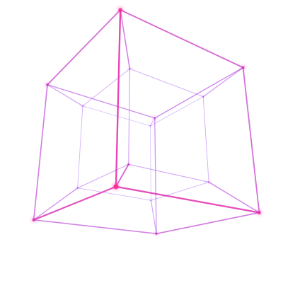

<div align="center">


<a href="https://www.linkedin.com/in/swastiksharma20">
  
</a>

<br/>

<a href="https://www.linkedin.com/in/swastiksharma20">
  
</a>
<a href="mailto:swastik.sharma3009@gmail.com">
  
</a>
<a href="https://github.com/voidsilver22">
  
</a>


</div>

## `>` whoami

<table>
<tr>
<td width="58%" valign="middle">
I build systems that sit at the edge of what's currently possible <b>hybrid quantum-classical machine learning</b> pipelines, <b>physics-informed deep learning</b> for scientific imaging, and the low-level runtimes underneath both. I like problems where the research isn't settled yet and the engineering still has to ship.
 
</td>
<td width="42%" align="center" valign="middle">

<sub> a hypercube ? really ? </sub>
 
</td>
</tr>
</table>

```python
class Swastik:
    role      = "ML Engineer"
    focus     = ["Quantum ML", "Deep Learning", "Agentic AI", "Systems Programming"]
    comfort   = "somewhere between a stormy night and a Bloch sphere"
    believes  = "a paper you can't reproduce is a rumour"
 
    def current(self):
        return {
            "researching": "SAR: Synthetic Aperture Radar",
            "building":    "interesting stuff ...",
            "reading":     "anything on Geospatial imaging",
            "open_to":     "research collaborations & ML roles",
        }
```
 
<div align="center">

</div>

## `>` the stack

Grouped by the layer it lives at — the machine and the model at the bottom, everything it takes to ship them above.

<table>
<tr>
<td width="160" valign="middle"><b><code>00</code></b><br/><sub>LEARNING&nbsp;&amp;<br/>SYSTEMS</sub></td>
<td valign="middle">


</td>
</tr>
<tr>
<td width="160" valign="middle"><b><code>01</code></b><br/><sub>SCIENTIFIC</sub></td>
<td valign="middle">


</td>
</tr>
<tr>
<td width="160" valign="middle"><b><code>02</code></b><br/><sub>QUANTUM</sub></td>
<td valign="middle">


</td>
</tr>
<tr>
<td width="160" valign="middle"><b><code>03</code></b><br/><sub>APPLICATION</sub></td>
<td valign="middle">


</td>
</tr>
<tr>
<td width="160" valign="middle"><b><code>04</code></b><br/><sub>INFRASTRUCTURE</sub></td>
<td valign="middle">


</td>
</tr>
<tr>
<td width="160" valign="middle"><b><code>05</code></b><br/><sub>INTERFACE</sub></td>
<td valign="middle">


</td>
</tr>
</table>

<div align="center">

</div>

## `>` projects

<div align="center">


<sub>repos are being cleaned up for public release</sub>


</div>

## `>` open to

Research collaborations, ML engineering roles, and anything involving quantum machine learning, scientific computing, or spaceflight software. If you're working on something in that neighbourhood, say hello.

<div align="center">

<a href="https://www.linkedin.com/in/swastiksharma20">
  
</a>

<br/><br/>

<sub><i>"The purpose of computing is insight, not numbers."</i> — Richard Hamming</sub>


</div>